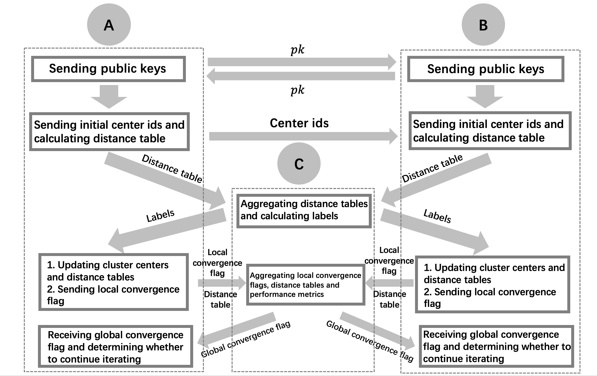

=================
Vertical K-means
=================

Introduction
------------

The calculation process for vertical Kmeans (two parties in this example) is illustracted as follows, 
where A and B are trainer or label_trainer who own the data, C is the assist_trainer who performs aggregation operations.

Parameters List
---------------

**identity**: ``str`` Federated identity of the party, should be one of `label_trainer`, `trainer` or `assist trainer`.

**model_info**:  
    - **name**: ``str`` Model name, should be `vertical_kmeans`.
    - **config**: ``map`` Model configuration, no need to config here.

**input**:  
    - **trainset**:
        - **type**: ``str`` Train dataset type, support `csv`.
        - **path**: ``str`` If type is `csv`, folder path of train dataset.
        - **name**: ``bool`` If type is `csv`, file name of train dataset.
        - **has_id**: ``bool`` If type is `csv`, whether dataset has id column.
        - **has_label**: ``bool`` If type is `csv`, whether dataset has label column.
**output**:  
    - **model**: 
        - **path**: ``str`` Folder path of the output.
        - **name**: ``str`` File name of the output.

**train_info**:  
    - **device**: ``str`` Device on which the algorithm runs, support `cpu`.
    - **aggregation_config**:
        - **type**: ``str`` Aggregation method, support "fedavg".
        - **encryption**:
            - **method**: ``str`` Encryption method, recommend "otp".
            - **key_bitlength**: ``int`` Key length of one time pad encryption, support 64 and 128.
            - **data_type**: ``str`` Input data type, support `torch.Tensor` and `numpy.ndarray`, depending on model data type.
            - **key_exchange**:
                - **key_bitlength**: ``int`` Bit length of paillier key, recommend to be greater than or equal to 2048.
                - **optimized**: ``bool`` Whether to use optimized method.
            - **csprng**:
                - **name**: ``str`` Pseudo-random number generation method.
                - **method**: ``str`` Corresponding hash method.
            - **weight_factor**: ``list`` or ``float`` Weight factor of the local data, need to be set for non-assist_trainer.
            - **params**:
                - **k**: ``int`` Number of clusters.
                - **max_iter**: ``int`` Maximum iteration.
                - **tol**: ``float`` Convergence threshold.
                - **extra_config**:
                    - **shuffle_seed**: ``int`` Random seed.