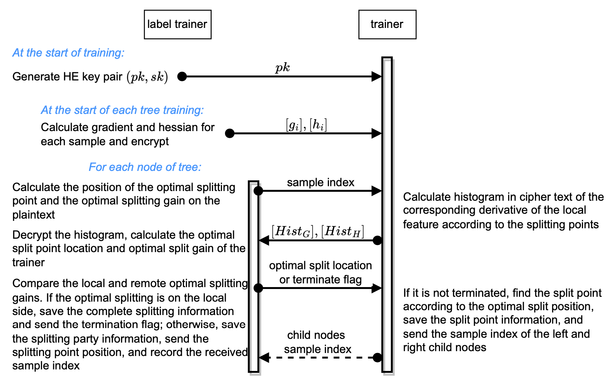

=================
Vertical XGBoost
=================

Introduction
-----------------

The vertical XGBoost is a federated implementation of the popular machine learning model XGBoost.
The `label trainer` receives the sum of the 
first and second order derivatives split by bins from the `trainer`, ensuring no leakage on the feature 
values of `trainer` as well as their comparative relationship. On the other side, the `trainer` get the homomorphic ciphertext of the 
first and second order derivatives, ensuring no leakage on the label and features of the 
`label trainer`, as well as the derivatives.

The algorithm can be described as follows,

Parameters List
---------------

**identity**: ``str`` Federated identity of the party, should be one of the `label_trainer`, `trainer` or `assist trainer`.

**model_info**:
    - **name**: ``str`` Model name, should be `vertical_xgboost`.
    - **config**: ``map`` Model configuration, `{}`, no need to config here.

**input**:
    - **trainset**: 
        - **type**: ``str`` Train dataset type, support `csv`.
        - **path**: ``str`` If type is `csv`, folder name of train dataset.
        - **name**: ``str`` If type is `csv`, file name of train dataset.
        - **has_id**: ``bool`` If type is `csv`, whether dataset has id column.
        - **has_label**: ``bool`` If type is `csv`, whether dataset has label column.
    - **valset**: 
        - **type**: ``str`` Validation dataset type, support `csv`.
        - **name**: ``str`` If type is `csv`, file name of validation dataset.
        - **path**: ``str`` If type is `csv`, folder name of validation dataset.
        - **has_id**: ``bool`` If type is `csv`, whether dataset has id column.
        - **has_label**: ``bool`` If type is `csv`, whether dataset has label column.

**output**:
    - **model**:
        - **path**: ``str`` Folder name of output model.
        - **name**: ``str`` File name of output model.
    - **metrics**:
        - **path**: ``str`` Folder name of output metrics.
    - **evaluations**:
        - **path**: ``str`` Folder name of output evaluations.
        
**train_info**:
    - **device**: ``str`` Device on which the algorithm runs, support `cpu`.
    - **interaction_params**:
        - **save_frequency**: ``int`` Frequency(per tree) to save model, set to -1 for not saving model.
        - **echo_training_metrics**: ``bool`` Whether to output metrics on train dataset.
        - **write_validation_prediction**: ``bool`` Whether to save predictions on validation dataset. 
    - **params**:
        - **task_type**: ``str`` Task type, support `classification`.
        - **lossfunc_config**: ``map`` Configuration of loss function.
            - **method**: ``str`` Name of loss function, support `BCEWithLogitsLoss`.
        - **num_trees**: ``int`` Number of trees.
        - **learning_rate**: ``float`` Learning rate.
        - **gamma**: ``float`` L1 regularization term on number of leafs.
        - **lambda**: ``float`` L2 regularization term on weights.
        - **max_depth**: ``int`` Max depth of tree.
        - **num_bins**: ``int``  Max number of bins.
        - **min_split_gain**: ``float`` Min split gain. 
        - **min_sample_split**: ``int``  Min number of samples in a tree node.
        - **feature_importance_type**: ``str``  Type of feature importance, support `gain` and `split`.
        - **run_goss**: ``bool`` Whether to use goss sampling.
        - **top_rate**: ``float`` The retain ratio of large gradient data in goss.
        - **other_rate**: ``float`` The retain ratio of small gradient data in goss, `0 < top_rate + other_rate <= 1`.
        - **metric_config**: ``map`` Metrics configuration, support `decision_table` , `ks` , `acc` , `auc` , `precision` , `recall` , `f1_score` , `decision_table`.
        - **early_stopping_params**:
            - **key**: ``str`` Metrics name for early stopping.
            - **patience**: ``int`` Number of steps with no improvement after which training will be stopped.
            - **delta**: ``float`` Minimum change in the value of metric to qualify as an improvement.

        - **encryption_params**:
            - **paillier**:
                - **key_bit_size**: ``int`` Bit length of paillier key, recommend to be greater than or equal to 2048.
                - **precision**: ``int`` Precison.
                - **djn_on**: ``bool`` Whether to use djn method to generate key pair.
                - **parallelize_on**: ``bool`` Whether to use multicore for computing.
        - **subsample_feature_rate**: ``float`` Subsample rate of feature dimension.
        - **max_num_cores**: ``int`` Max number of cpu cores for computing.
        - **validation_batch_size**: ``int`` Batch size for validation.
        - **col_batch**: ``int`` Number of features used in a batch during node splitting.
        - **row_batch**: ``int`` Number of samples used in a batch during node splitting.