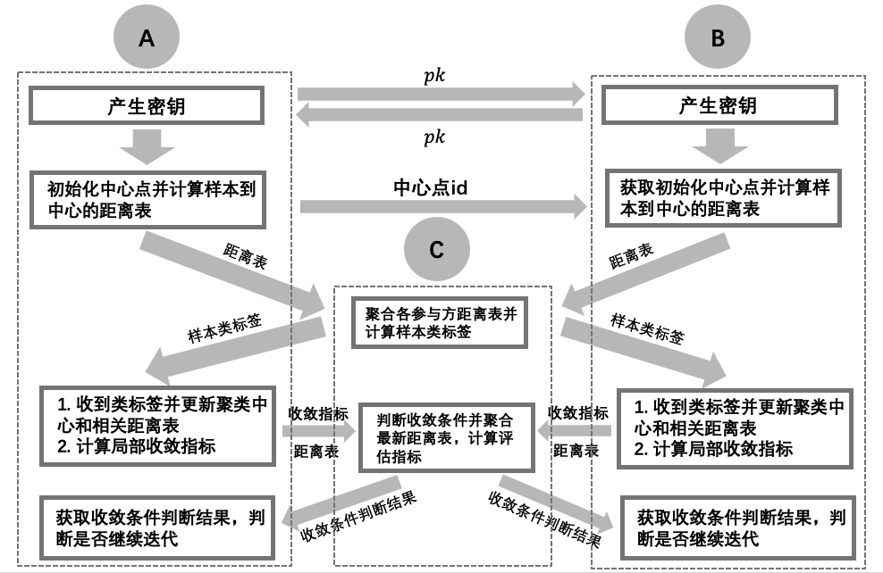

=================
Vertical K-means
=================

简介
-----

Vertical Kmeans是把聚类算法Kmeans模型建立在纵向联邦体系上得到的模型。
纵向Kmeans（本示例为两方）的计算步骤流程如下图所示，其中A为有标签的参与方，B为无标签的参与方，C是做聚合操作的assist方

参数列表
--------

**identity**: ``str``  表示该计算节点的身份类型, 只能为 `label_trainer` (带标签的trainer), `trainer` (无标签的trainer), `assit trainer` (无数据仅辅助计算的trainer)之一

**model_info**:
    - **name**: ``str``  模型名称 (必须严格对应算法库中支持的模型), 在本模块中是 `vertical_kmeans`。

**input**:
    - **trainset**:
        - **type**: ``str``  训练数据类型。
        - **path**: ``str``  训练数据所在文件读取路径。
        - **name**: ``str``  训练数据文件名。
        - **has_id**: ``bool``  是否有id。
        - **has_label**: ``bool``  是否有label。

**output**:
    - **path**: ``str``  模型输出文件路径。
    - **model**:
        - **name**: ``str``  训练模型输出文件名。
    - **result**:
        - **name**: ``str``  输出结果文件名。
    - **summary**:
        - **name**: ``str``  训练模型输出文件名。

**train_info**:
    - **train_params**
        - **init**: ``str``  初始化方法。目前支持 `random` 和 `kmeans++`。
        - **encryption**:
            - **otp**:
                - **key_bitlength**: ``int``  一次一密的密钥长度，支持64和128，推荐128，则安全强度为128。
                - **data_type**: ``str``  输入的数据类型，目前支持"torch.Tensor"和"numpy.ndarray"，根据模型实际使用的类型决定。
                - **key_exchange**:
                    - **key_bitlength**: ``int``  密钥长度。
                    - **optimized**: ``bool``  是否使用优化的方法。
                - **csprng**:
                    - **name**: ``str``  伪随机数生成方法。
                    - **method**: ``str``  该方法中使用的Hash算法。
        - **k**: ``int``  聚类类别数。
        - **max_iter**: ``int``  最大迭代次数。
        - **tol**: ``float``  算法收敛的阈值。
        - **random_seed**: ``int``  随机种子设置。