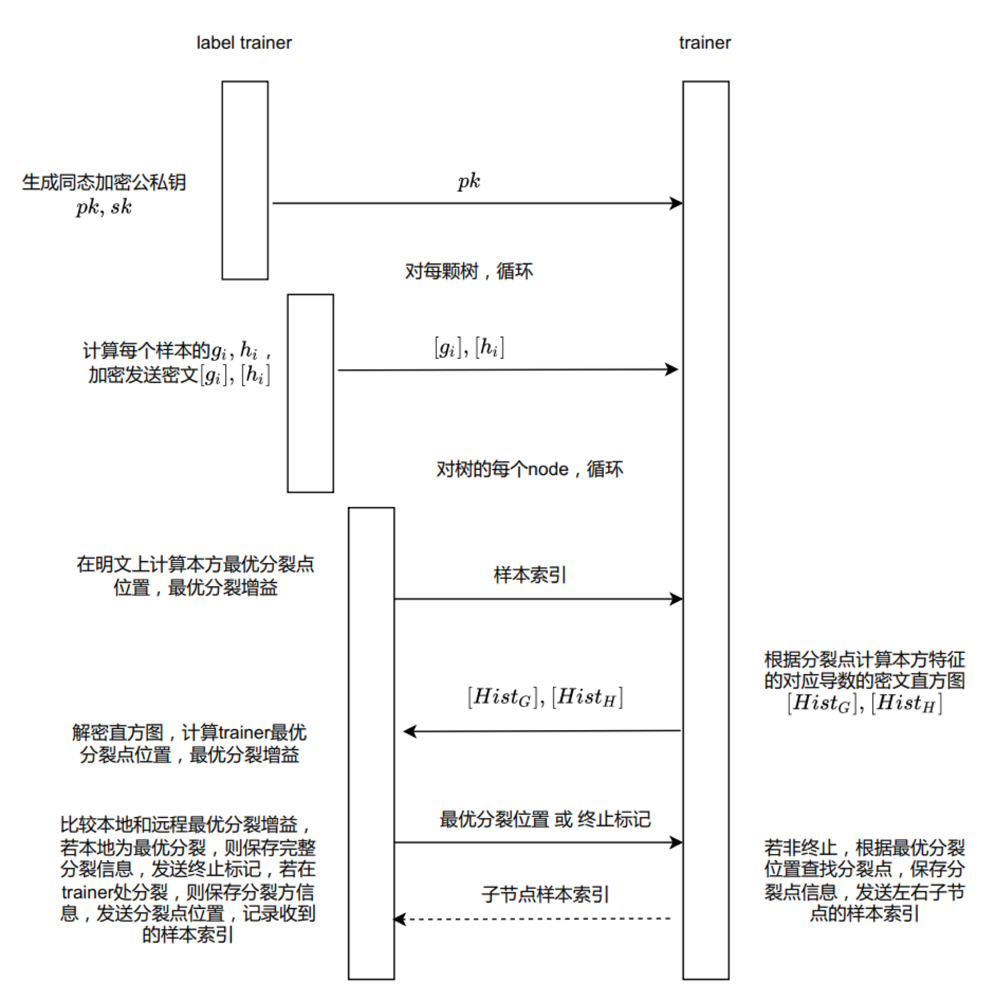

=================
Vertical XGBoost
=================

简介
-----

纵向xgboost模型是将机器学习中的xgboost模型建立在纵向联邦体系上得到的模型。在安全性方面使用Paillier加法半同态加密算法，密钥长度2048位，对应安全强度112位。其中，Label trainer代表有标签方；Trainer代表无标签方。
Label trainer方收到trainer发送的每个分箱中的一阶导数和二阶导数的和，trainer方的特征和其大小关系没有泄漏；Trainer得到一阶导数和二阶导数的密文，Label trainer的特征和标签没有泄漏，一阶和二阶导数也没有泄漏。 全流程如下：

::

    输入：各参与方的训练集和验证集
    输出：Label trainer输出树的结构和叶子节点权重；所有参与方输出在本方分裂的特征和分裂点信息。

    1. Label trainer生成同态加密公私钥，将公钥发送到trainer方;
    2. 循环训练每颗决策树，对第颗树：
      i) Label trainer计算每个样本的一阶导数和二阶导数，加密后将密文和发送到trainer方；
      ii) 循环决策树的所有节点直到达到设计深度，对第j个节点：
        a) Label trainer计算本地特征的分裂点和分裂增益，发送该节点样本索引到trainer；
        b) Trainer在密文上计算本地特征的所有分箱内一阶导数和二阶导数之和，发送到Label trainer；
        c) Label trainer解密导数之和，计算Trainer所有特征的分裂增益；
        d) Laber trainer比较得到最大增益位置，若最大增益位置位于本方特征，则保存分裂点信息，发送终止分裂信号到trainer方，否则发送分裂位置到trainer方；
        e) Trainer方若收到分裂位置信息，则保存本方分裂点信息，发送分裂后的左右节点索引到Label trainer；
        f) Label trainer分裂节点，生成左右子节点。

参数列表
--------

具体参数定义如下：

**identity**: ``str`` 表示该计算节点的身份类型，只能为 `label_trainer` (带标签的trainer)， `trainer` (无标签的trainer)， `assit trainer` (无数据仅辅助计算的trainer)之一

**model_info**:
    - **name**: ``str`` 表示模型名称 (必须严格对应算法库中支持的模型)，在本模块中是 `vertical_xgboost`

**input**:
    - **trainset**:
        - **type**: ``str`` 训练集类型，支持 `csv`
        - **path**: ``str`` 当 `type` 为 `csv` 时，表示训练集所在文件夹路径
        - **name**: ``str`` 当 `type` 为 `csv` 时，表示训练集文件名
        - **has_id**: ``bool`` 当 `type` 为 `csv` 时，表示是否有id列
        - **has_label**: ``bool`` 当 `type` 为 `csv` 时，表示是否有label列

    - **valset**:
        - **type**: ``str`` 验证集类型，支持 `csv`
        - **path**: ``str`` 当 `type` 为 `csv` 时，表示验证集所在文件夹路径
        - **name**: ``str`` 当 `type `为 `csv` 时，表示验证集文件名
        - **has_id**: ``bool`` 当 `type` 为 `csv` 时，表示是否有id列
        - **has_label**: ``bool`` 当 `type` 为 `csv` 时，表示是否有label列

**output**:
    - **path**: ``str`` 输出文件夹路径
    - **model**:
        - **name**: ``str`` 输出模型文件名
    - **metric_train**:
        - **name**: ``str`` 训练集指标文件名
    - **metric_val**:
        - **name**: ``str`` 验证集指标文件名
    - **prediction_train**:
        - **name**: ``str`` 训练集预测结果文件名
    - **prediction_val**:
        - **name**: ``str`` 验证集预测结果文件名
    - **ks_plot_train**:
        - **name**: ``str`` 训练集ks表文件名
    - **ks_plot_val**:
        - **name**: ``str`` 验证集ks表文件名
    - **decision_table_train**:
        - **name**: ``str`` 训练集决策表文件名
    - **decision_table_val**:
        - **name**: ``str`` 验证集决策表文件名
    - **feature_importance**:
        - **name**: ``str`` 特征重要性表文件名

**train_info**:
    - **interaction_params**:
        - **save_frequency**: ``int`` 模型存储频率，以树的棵树为单位，-1表示不保存中间模型。
        - **echo_training_metrics**: ``bool`` 是否保存训练集的指标
        - **write_training_prediction**: ``bool`` 是否保存训练集预测结果
        - **write_validation_prediction**: ``bool`` 是否保存验证集预测结果

    - **train_params**:
        - **lossfunc**: ``map`` 损失函数配置. 格式为：{ `损失函数名` : { `具体配置` }}. 例如："BCEWithLogitsLoss": {}
        - **num_trees**: ``int``  树的个数
        - **learning_rate**: ``float``  学习率
        - **gamma**: ``float`` 叶子节点个数的L1正则项
        - **lambda**: ``float`` 权重的L2正则项
        - **max_depth**: ``int`` 树的最大深度
        - **num_bins**: ``int``  分箱个数
        - **min_split_gain**: ``float`` 最小分裂收益，正数
        - **min_sample_split**: ``int``  树节点中的最少样本数
        - **feature_importance_type**: ``str``  特征重要性类型，支持 `gain` 和 `split`
        - **downsampling**: ``map``
            - **column**: ``map``
                - **rate**: ``float`` 特征维度采样率
            - **row**: ``map``
                - **run_goss**: ``bool`` 是否使用goss样本采样
                - **top_rate**: ``float`` 高权重的样本比例
                - **other_rate**: ``float`` 低权重的样本比例，`0 < top_rate + other_rate <= 1`
        - **category**: ``map``
            - **cat_smooth**: ``float`` 用于减少噪声对类别特征的影响的参数. 默认为0
            - **cat_feature**: ``map`` 配置类别特征的参数. 公式为: features that column indexes are in col_index if col_index_type is 'inclusive' or not in col_index if col_index_type is 'exclusive'. `union`` featuresthat column names are in col_names if col_names_type is 'inclusive' or not in col_names if col_names_type is 'exclusive'. `union if max_num_value_type is 'union' or intersect if max_num_value_type is 'intersection'` features that number of different values is less equal than max_num_value
                - **col_index** ``str``: 是（或不是）类别特征的特征列索引。接受切片或数字，如: `"1, 4:5"` . 默认为""
                - **col_names** ``list<str>``: 是（或不是）类别特征的特征列名. 默认为[]
                - **max_num_value** ``int``: 若一列特征的唯一值数量大于等于该值，则该列特征是类别特征. 默认为0
                - **col_index_type** ``str``: 支持 'inclusive' and 'exclusive'. 默认为 'inclusive'.
                - **col_names_type** ``str``: 支持 'inclusive' and 'exclusive'. 默认为 'inclusive'.
                - **max_num_value_type** ``str``: 支持 'intersection' and 'union'. 默认为 'union'.
        - **metric**: ``map`` 性能评估指标，一下所有键值均为可选项
            - **decision_table**: ``map``
                - **method**: ``str`` 支持 "equal_frequency" and "equal_with"
                - **bins**: ``int`` 决策表中的分箱数量
            - **acc**: {}
            - **precision**: {}
            - **recall**: {}
            - **f1_score**: {}
            - **auc**: {}
            - **ks**: {}
        - **early_stopping**:
            - **key**: ``str`` 判断训练是否早停的指标名，支持metric中填写的指标
            - **patience**: ``int`` 早停前可接受的指标没有发生改善的最大步长
            - **delta**: ``float`` 指标变化值，低于改值视为没有改善
        - **encryption**:
            - **paillier**:
                - **key_bit_size**: ``int`` paillier密码密钥长度，至少应大于等于2048
                - **precision**: ``int`` 精度相关参数，可为null或正整数，如7
                - **djn_on**: ``bool`` 是否采用DJN方法来生成密钥对
                - **parallelize_on**: ``bool`` 是否使用多核并行计算
            - **plain**: ``map`` 无加密，"plain"和"paillier"二选一
        - **max_num_cores**: ``int`` 可用最大cpu核数
        - **batch_size_val**: ``int`` 验证集上做预测时的batch大小
        - **advanced**: ``map``
            - **col_batch**: ``int`` 节点分裂时一次通信所涉及的特征数量
            - **row_batch**: ``int`` 节点分裂时一个batch中处理的样本数量

.. [SecureBoost] Cheng K, Fan T, Jin Y, et al. Secureboost: A lossless federated learning framework[J]. IEEE Intelligent Systems, 2021, 36(6): 87-98.

