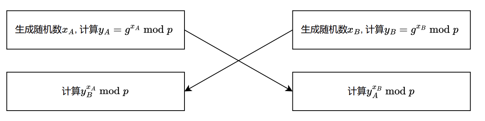

============
密码算法
============

XFL使用了半同态加密、全同态加密、一次一密等密码技术对梯度、模型参数、中间参数等敏感信息进行加密， 保护联邦过程的安全。

同态密码
============

Paillier
------------

Paillier [#Paillier]_ 密码算法是一种加法半同态密码算法，基于判定性合数剩余假设(Decisional Composite Residuosity Assumption)困难问题，是一种比较成熟的半同态密码算法。

.. Paillier算法的原理如下：

.. - 密钥生成

.. - 加密

.. - 解密

.. - 加法

.. - 标量乘法

XFL使用自行开发的Paillier算法. 推荐使用不低于2048位密钥长度的Paillier算法，计算安全强度不低于112位。

CKKS
------------

CKKS [#CKKS]_ 是一种效率较高的全同态加密算法，基于RLWE(Ring Learning with Errors)困难问题，
支持密文加法和密文乘法。CKKS密码算法支持SIMD(Single Instruction Multiple Data)，批量运算时效率很高。
XFL调用基于Seal [#Seal]_ 的第三方库TenSeal [#TenSeal]_ 中提供的CKKS算法. CKKS有多种参数组合均满足较高的安全性，
用户可根据实际的数据来选择合适的参数组合来达到最优的效率和精度要求。例如在纵向逻辑回归的示例中，我们采用的CKKS参数为：
::

    "poly_modulus_degree": 8192，
    "coeff_mod_bit_sizes": [60， 40， 40， 60]，
    "global_scale_bit_size": 40

其计算安全强度大于等于128位。

安全聚合中的密码算法
================================

横向联邦安全聚合算法 [#FedAvg]_ 是一种比较高效的聚合方法，它包含了Diffile-Hellman密钥交换，安全伪随机数生成器和一次一密加密方法。

Diffile-Hellman密钥交换
--------------------------------

密钥交换的原理如下：

Alice和Bob约定一个大素数 :math:`p` 和本原根 :math:`g`. 进行如下操作：

双方得到相同的随机数。XFL中使用RFC 7919 [#RFC7919]_ 中推荐的参数。在使用时，推荐使用比特长度大于等于3072位的素数 :math:`p`，计算安全强度大于等于125.

安全伪随机数生成器
--------------------------------

安全伪随机数生成器通过输入一个随机种子密钥来生成随机比特串。XFL目前支持 [#SP800-90a]_ 中规定的hmac_drbg方式来生成安全伪随机数，其计算安全强度为所选择的Hash算法的输出比特位数的一半。
在使用时，推荐使用输出比特位数大于等于256位的Hash算法，如sha256，且安全伪随机数生成器的输入随机种子比特位数应不低于Hash算法的输出比特位数。

一次一密方法
--------------------------------

一次一密是一种经典的加密方式，其特点是每次加密使用不同的密钥。一次一密有多种不同的表现形式，如按比特异或、模加等。XFL采用的是模加形式，在进行模加前需要
先将要加密的浮点数编码成整数，目前模数支持  :math:`2^{64}` 和 :math:`2^{128}` 两种，统计安全参数分别为64位和128位。

:参考文献:

.. [#Paillier] Paillier P. Public-key cryptosystems based on composite degree residuosity classes[C]//International conference on the theory and applications of cryptographic techniques. Springer, Berlin, Heidelberg, 1999: 223-238.
.. [#CKKS] Cheon J H, Kim A, Kim M, et al. Homomorphic encryption for arithmetic of approximate numbers[C]//International conference on the theory and application of cryptology and information security. Springer, Cham, 2017: 409-437.
.. [#Seal] https://github.com/microsoft/SEAL.
.. [#TenSeal] https://github.com/OpenMined/TenSEAL.
.. [#RFC7919] Gillmor D. Negotiated finite field Diffie-Hellman ephemeral parameters for transport layer security (TLS)[R]. 2016..
.. [#FedAvg] Bonawitz K, Ivanov V, Kreuter B, et al. Practical secure aggregation for privacy-preserving machine learning[C]//proceedings of the 2017 ACM SIGSAC Conference on Computer and Communications Security. 2017: 1175-1191.
.. [#SP800-90a] Barker E, Kelsey J. NIST special publication 800-90a recommendation for random number generation using deterministic random bit generators[J]. 2012.