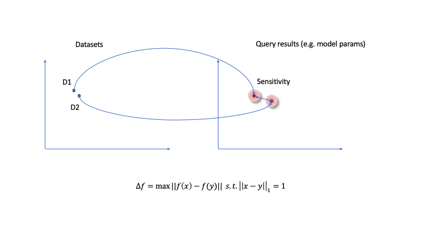
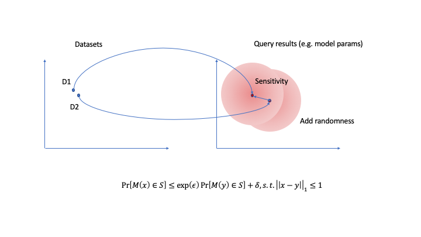

==================
差分隐私
==================

简介
--------------

在我们的框架中，差分隐私是为了解决这样一个问题：怎样可以让算法学到的模型在人群（population）中的表现足够好，但是又能保护好个人（individual）的信息不会泄露。

差分隐私的基本思路是：在算法的学习过程中加入噪声，使得相差一条记录的数据集在算法产出的模型上基本是不可分辨的。

如上面左图所示，算法会把数据集映射到参数空间里。由于一些随机性（比如神经网络的初始化），学到的模型参数有一个概率分布。在一般情况下，如果两个数据集里有不同，那么学到的参数是可以区分的（见左图）。也就是说通过模型参数的不同，我们可以区分出两个数据集的不同。考虑一个极端情况，D1除了多了一条个人记录之外和D2完全相同。那么可以通过最终模型的不同判断出这条个人记录是否包含在数据集里。差分隐私加入噪声之后，模型参数已经很难区分（见右图），那么我们就无法判断出那条特定的个人记录是否包含在数据集里。

数学定义
----------------

我们引入一些数学定义来量化上面的论证过程。如何衡量算法的隐私保护程度呢？一个常用的定义是 :math:`(\epsilon, \delta)` -差分隐私。具体定义如下（参见 [Dwork2014]_ ）：一个作用在 :math:`\mathbb{N}^{|\mathcal{X}|}` 随机算法 :math:`\mathcal{M}` 如果对于所有的陪域 :math:`Range(\mathcal{M})` 的子集 :math:`\mathcal{S}` 都满足

.. math::
    Pr[\mathcal{M}(D_1) \in \mathcal{S}] \leq \exp(\epsilon) Pr[\mathcal{M}(D_2) \in \mathcal{S}] + \delta

只要 :math:`||D_1-D_2||_1 \leq 1`。那么我们就说算法 :math:`\mathcal{M}` 可以提供 :math:`(\epsilon, \delta)` -差分隐私。

上面定义中的 :math:`\mathcal{M}` 的作用域 :math:`\mathbb{N}^{|\mathcal{X}|}` 是所有可能的数据库取值， :math:`D_1` 和 :math:`D_2` 是两个数据集。 :math:`Range(\mathcal{M})` 是模型输出，比如训练好的神经网络模型。约束条件 :math:`||D_1-D_2||_1 \leq 1` 是指两个数据集只差一条记录。

联邦学习里的差分隐私
-------------------------

我们在联邦学习里也引入了保护差分隐私的算法Noise before model aggregation FL(NbAFL)（参见 [Wei2020]_）。简单来说，就是在模型参数进行fedavg时，上行和下行都加入合适的噪声来保护数据隐私。

.. [Dwork2014] C. Dwork and A. Roth, The Algorithmic Foundations of Differential Privacy, Foundations and Trends in Theoretical Computer Sicence, Vol 9, (2014) 211-407
.. [Wei2020] K. Wei et al., Federated Learning with Differential Privacy: Algorithms and Performance Analysis, IEEE Transactions on Information Forensics and Security, 1556-2021 (2020) 