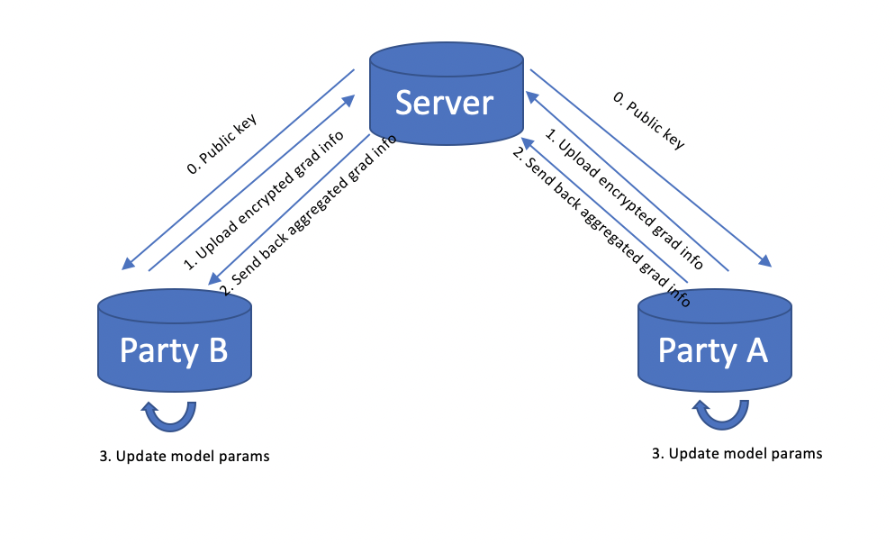
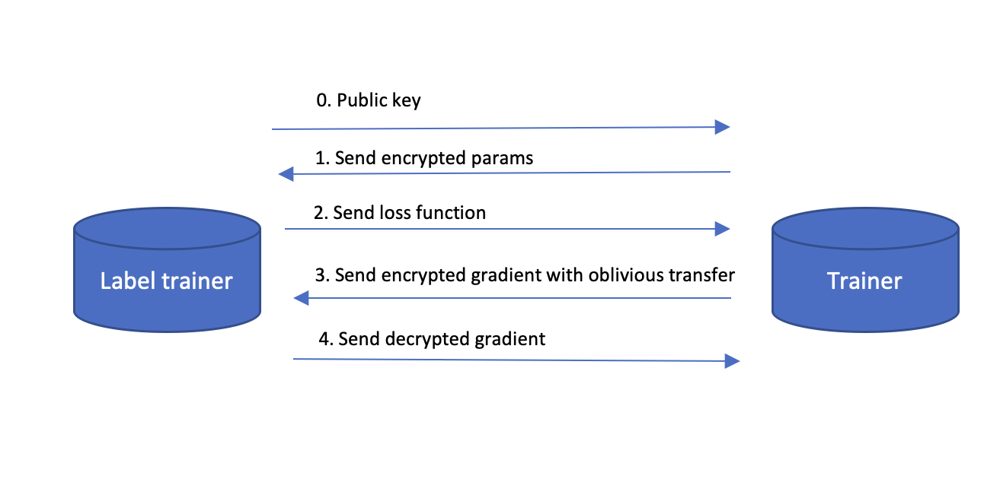

# XFL介绍

## 联邦学习
联邦学习是指在进行机器学习的过程中，各个参与方可以在不共享私有数据资源的前提下（即数据不出本地），联合其他方数据进行建模和训练，从而在构建多方共享的机器学习模型

### 特点
- 数据隔离：各参与方数据保留于本地，隐私不会泄漏， 数据可用而不可见
- 对等获益：在联邦学习体系下，各个参与方联合建立共有模型，地位平等，共同获益
- 无损：联邦学习建立模型的效果基本接近或等同于数据统一一处进行建模的效果

### 分类
- 横向联邦学习：参与方数据集用户特征重叠较多而用户重叠较少
- 纵向联邦学习：参与方数据集用户重叠较多而用户特征重叠较少
- 联邦迁移学习：参与方数据集的用户与用户特征重叠都较少

在我们的框架里，算法根据数据来源的特征，分成三类：

1. `Local`（或`standalone`）：数据完全在本地，算法独立运行
2. `Horizontal`：横向联邦学习。数据样本分布在不同参与方，有共享数据特征集
3. `Vertical`：纵向联邦学习。数据特征分布在不同参与方，数据样本共享或重合

其中横向联邦学习的训练流程为：

0. 服务器给参与方分发公钥
1. 各参与方利用本地数据训练模型并计算各自的梯度，经加密后传输回服务器。
2. 服务器聚合各参与方的梯度并更新模型参数，发送回各参与方。
3. 各参与方更新各自模型。
4. 迭代1-3步

示意图如下

纵向联邦学习的训练流程示例如下：

0. 有标签方生成公钥，将公钥发送给标签方
1. 无标签方计算中间参数并加密传递给有标签方
2. 有标签方计算损失值并传递给无标签方
3. 无标签方计算梯度并增加经过加密的随机掩码后传递给标签方
4. 标签方解密梯度并返回给无标签方
5. 迭代1-4步

示意图如下

## 参与方角色
### Scheduler
联邦学习训练流程任务总调度器，协助集群组网，控制Trainer，负责联邦学习任务的下发和管理

### Trainer
联邦学习联合模型训练的执行节点，受Scheduler调度，联邦学习的参与方都将有一个或者多个与联邦参数服务器通信的Trainer，通常包含：
- trainer 参与方训练节点，数据集不含标签，通常为联邦学习发起方
- label trainer 参与方训练节点， 数据集含标签，通常为联邦学习参与方

部分包含：
- assist trainer  用于辅助训练的节点，如进行横向的梯度聚合等

## 数据集
### 自定义数据集
为了能更好地在自定义数据集上运行XFL算子，请修改数据满足如下约定：
- 数据文件以逗号分割，且必须包含表头。
- 第一列存放id数据（若有），且列名为`id`，第二列存放标签列（若有），且列名为`y`。
- 暂不支持字符串数据，需要对数据做预处理清洗。

<!-- ## 架构图 -->

